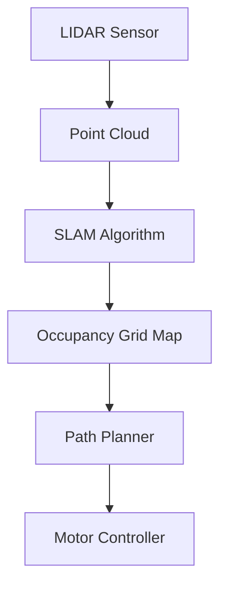

# ADR-004: Technical Content Rendering Stack

> **Scope**: Presentation layer for equations, code, diagrams - technical content critical for robotics education.

- **Status:** Accepted
- **Date:** 2025-01-13
- **Feature:** textbook-platform
- **Context:** Rendering robotics content with math equations (kinematics, control theory), code examples (Python, C++, YAML), and diagrams (architecture, sensor flows)

<!-- Significance checklist (ALL must be true to justify this ADR)
     1) Impact: Long-term consequence for architecture/platform/security? ✅ YES - affects how all technical content displays
     2) Alternatives: Multiple viable options considered with tradeoffs? ✅ YES - 2-3 alternatives per component
     3) Scope: Cross-cutting concern (not an isolated detail)? ✅ YES - every lesson potentially uses all three components
     If any are false, prefer capturing as a PHR note instead of an ADR. -->

## Decision

**Integrated rendering stack: KaTeX for math + Mermaid/images hybrid for diagrams + Prism for code.**

**Rendering Stack:**
- **Math Rendering:** KaTeX (via @docusaurus/remark-plugin-katex)
- **Diagram Rendering:** Mermaid for simple diagrams + external images for complex visualizations
- **Code Highlighting:** Prism with Palenight (dark) / GitHub (light) themes
- **Additional Languages:** bash, cpp, yaml, xml for robotics content

**Configuration:**
```javascript
// docusaurus.config.js
const prismThemes = require('prism-react-renderer/themes');

module.exports = {
  themes: ['@docusaurus/theme-mermaid'],
  presets: [
    [
      '@docusaurus/preset-classic',
      {
        docs: {
          remarkPlugins: [require('@docusaurus/remark-plugin-katex')],
        },
      },
    ],
  ],
  themeConfig: {
    prism: {
      theme: prismThemes.github,
      darkTheme: prismThemes.palenight,
      additionalLanguages: ['bash', 'cpp', 'yaml', 'xml'],
    },
  },
  markdown: {
    mermaid: true,
  },
};
```

## Consequences

### Positive

- **Fast math rendering** - KaTeX significantly faster than MathJax
- **Pre-rendered equations** - static at build time, no client-side lag
- **Version-controlled diagrams** - Mermaid diagrams are text-based (Git tracked)
- **Automatic theming** - Mermaid switches light/dark with site theme
- **Robotics language support** - Python, C++, YAML, bash all well-supported
- **Small bundle size** - KaTeX ~150KB vs MathJax ~500KB+
- **Great code readability** - Palenight optimized for long code blocks

### Negative

- **Two diagram systems** - must maintain Mermaid syntax + image management
- **Mermaid complexity limit** - can't handle 3D kinematics or detailed screenshots
- **Manual image updates** - external screenshots require regeneration when content changes
- **KaTeX feature limits** - fewer advanced math features than MathJax (not needed for robotics)

## Component Decisions

### Math Rendering: KaTeX over MathJax

| Factor | KaTeX | MathJax |
|--------|-------|---------|
| Rendering speed | Significantly faster | Slower |
| Library size | ~150KB | ~500KB+ |
| Build-time rendering | Yes | Runtime (slower) |
| Docusaurus support | Native plugin | Custom setup required |
| Advanced features | Fewer | More comprehensive |

**Decision:** KaTeX - Robotics content (kinematics, control theory) doesn't need advanced MathJax features. Performance and static rendering are priorities.

**Typical robotics equations:**
- Forward/inverse kinematics: $T = \begin{bmatrix} R & p \\ 0 & 1 \end{bmatrix}$
- Control laws: $\tau = M(q)\ddot{q} + C(q,\dot{q})\dot{q} + g(q)$
- Sensor fusion: $\hat{x}_{k|k} = \hat{x}_{k|k-1} + K_k(z_k - H\hat{x}_{k|k-1})$

All well within KaTeX capabilities.

### Diagram Rendering: Hybrid Approach

**Mermaid Use Cases:**
- Flowcharts (algorithm flows, control systems)
- Sequence diagrams (ROS 2 node communication)
- State diagrams (robot state machines)
- Architecture diagrams (system components)

**External Image Use Cases:**
- Complex 3D robot kinematics
- Gazebo/Isaac Sim screenshots
- Sensor data visualizations
- Hardware photos

**Rationale:** Mermaid provides version-controlled, themable diagrams for architecture. Images required for visual fidelity (screenshots, 3D models).

### Code Highlighting: Palenight/GitHub Themes

| Theme | Use Case | Rationale |
|-------|----------|-----------|
| **Palenight** | Dark mode (default) | Excellent contrast for Python, C++, YAML |
| **GitHub** | Light mode | Familiar, clean, high readability |

**Robotics Languages Supported:**
- `python` - ROS 2 Python nodes
- `cpp` - ROS 2 C++ nodes
- `yaml` - Robot descriptions, configs
- `bash` - Terminal commands
- `xml` - URDF robot models

## Alternatives Considered

### Math: MathJax
**Why rejected:** Slower rendering, larger bundle, runtime rendering. Robotics math doesn't require advanced features.

### Diagrams: Mermaid Only
**Why rejected:** Can't render complex 3D kinematics or simulation screenshots. Students need visual fidelity for Gazebo/Isaac Sim interfaces.

### Diagrams: Images Only
**Why rejected:** No version control, manual updates, no automatic theming. Architecture diagrams should be text-based for maintainability.

### Code: Dracula Theme
**Why rejected:** Good but slightly less contrast than Palenight for long code blocks. Palenight is Docusaurus default for good reason.

## Content Examples

### Math Rendering
```markdown
The forward kinematics for a 2-DOF manipulator:

$$
\begin{bmatrix}
x \\
y
\end{bmatrix}
=
\begin{bmatrix}
l_1 \cos(\theta_1) + l_2 \cos(\theta_1 + \theta_2) \\
l_1 \sin(\theta_1) + l_2 \sin(\theta_1 + \theta_2)
\end{bmatrix}
$$
```

### Mermaid Diagram
```markdown

```

### Code Block
````markdown
```python
#!/usr/bin/env python3
import rclpy
from rclpy.node import Node

class MinimalPublisher(Node):
    def __init__(self):
        super().__init__('minimal_publisher')
        self.publisher_ = self.create_publisher(String, 'topic', 10)
```

**Output:**
```
[INFO] [minimal_publisher]: Node started
```
````

## References

- Feature Spec: [spec.md](../specs/001-textbook-platform/spec.md)
- Implementation Plan: [plan.md](../specs/001-textbook-platform/plan.md)
- Research: [research.md](../specs/001-textbook-platform/research.md)
- Related ADRs: ADR-001 (Static Site Platform)
- Docusaurus Docs: https://docusaurus.io/docs/markdown-features/math-equations
- Docusaurus Docs: https://docusaurus.io/docs/markdown-features/diagrams
