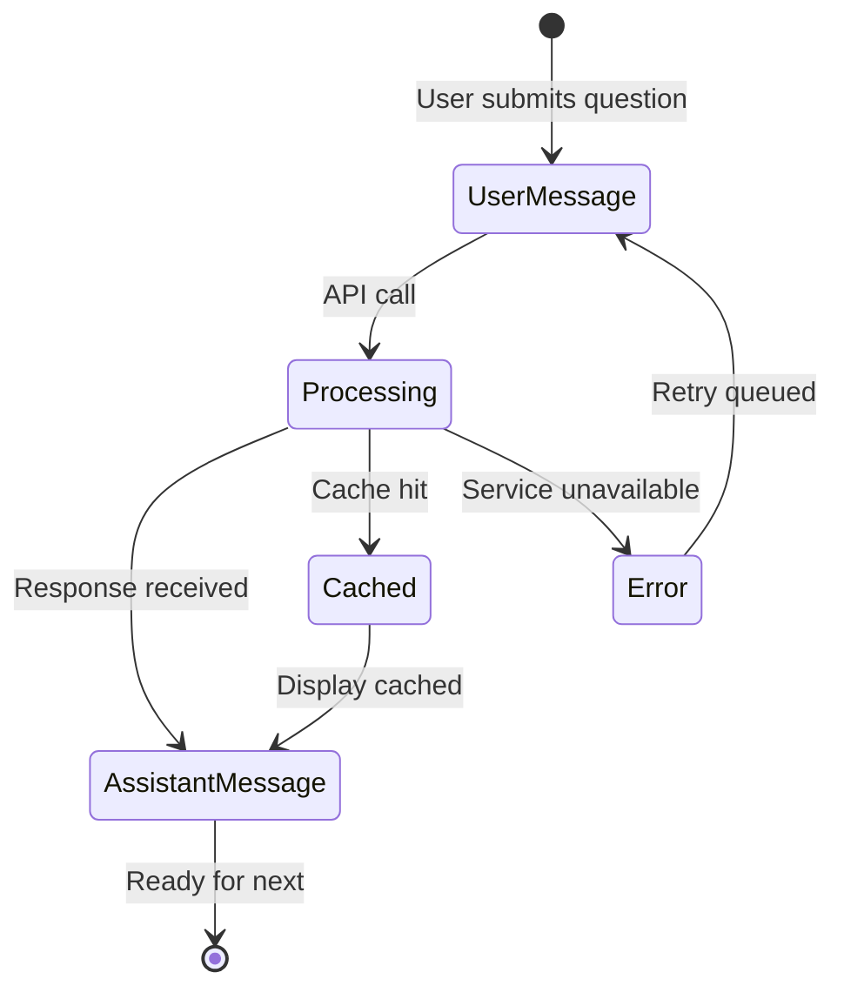
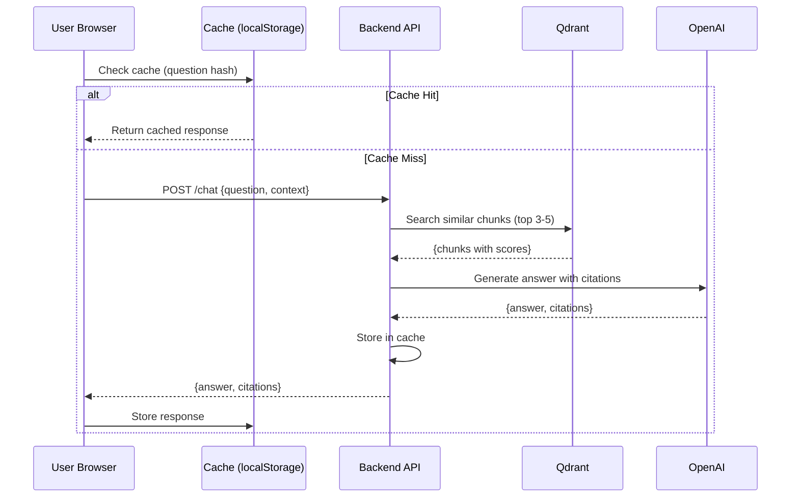

# Data Model: Integrated RAG Chatbot

**Feature**: 001-rag-chatbot | **Date**: 2025-01-15

---

## Overview

This document defines the data entities and their relationships for the RAG chatbot system. The model spans four domains: content indexing (Qdrant), chat interactions (browser + server), citations, and caching.

---

## Entity Relationship Diagram

```mermaid
erDiagram
    CONTENT_CHUNK ||--o{ CITATION_REFERENCE : cites
    CHAT_SESSION ||--o{ CHAT_MESSAGE : contains
    CHAT_MESSAGE ||--o| CITATION_REFERENCE : references
    CHAT_SESSION ||--o| CACHED_RESPONSE : uses
    CONTENT_CHUNK }|..|{ CHAT_MESSAGE : retrieved_for

    CONTENT_CHUNK {
        uuid chunk_id PK
        text string
        source_module string
        source_lesson string
        source_section string
        url_anchor string
        token_count int
        embedding vector(1536)
        created_at timestamp
    }

    CHAT_SESSION {
        string session_id PK
        timestamp created_at
        message array references
        context_window string array
    }

    CHAT_MESSAGE {
        string message_id PK
        enum message_type
        string content
        citation array references
        timestamp created_at
        boolean is_cached
    }

    CITATION_REFERENCE {
        string citation_id PK
        string module_id
        string lesson_title
        string section_heading
        string url_anchor
        float relevance_score
    }

    CACHED_RESPONSE {
        string cache_key PK
        string answer
        citation array
        timestamp created_at
        int ttl
        int hit_count
    }
```

---

## Domain 1: Content Indexing (Qdrant)

### ContentChunk

Stored in Qdrant Cloud as vectors with payload metadata.

| Field | Type | Description | Validation |
|-------|------|-------------|------------|
| `chunk_id` | UUID | Unique identifier for chunk | Auto-generated |
| `text` | string | The actual markdown content | 300-500 tokens, not empty |
| `source_module` | string | Module identifier (e.g., "module1-intro") | Must match module folder |
| `source_lesson` | string | Lesson filename without extension | Must exist in docs/ |
| `source_section` | string | Section heading (##) or "intro" | May be null |
| `url_anchor` | string | Fragment identifier for deep linking | Derived from section |
| `token_count` | integer | Approximate token count | 100-1000 (chunks are 300-500) |
| `embedding` | vector(1536) | OpenAI text-embedding-3-small | Generated at indexing time |
| `created_at` | timestamp | Index creation time | Auto-generated |

**Qdrant Collection Schema**:
```json
{
  "collection_name": "textbook_chunks",
  "vectors": {
    "size": 1536,
    "distance": "Cosine"
  },
  "payload_schema": {
    "text": "keyword",
    "source_module": "keyword",
    "source_lesson": "keyword",
    "source_section": "keyword",
    "url_anchor": "keyword",
    "token_count": "integer"
  }
}
```

**State Transitions**:
```
[New Content] → [Parsed] → [Chunked] → [Embedded] → [Stored]
```

---

## Domain 2: Chat Interactions

### ChatSession (Browser localStorage)

Session state stored entirely client-side. No server-side persistence.

| Field | Type | Description | Validation |
|-------|------|-------------|------------|
| `session_id` | string | UUID v4 for session identification | Auto-generated on first visit |
| `created_at` | timestamp | Session start time | Auto-generated |
| `messages` | array<ChatMessage> | Ordered list of messages in conversation | Max 50 for context window |
| `context_window` | array<string> | Message IDs for sliding window context | Last 10 message IDs |

**TypeScript Interface**:
```typescript
interface ChatSession {
  sessionId: string;
  createdAt: number;  // Unix timestamp
  messages: ChatMessage[];
  contextWindow: string[];  // Last 10 message IDs
}
```

### ChatMessage

Individual message in conversation.

| Field | Type | Description | Validation |
|-------|------|-------------|------------|
| `message_id` | string | Unique message identifier | Auto-generated |
| `message_type` | enum | "user" or "assistant" | Required |
| `content` | string | Message text | Required, max 5000 chars |
| `citations` | array<CitationReference> | Source references (assistant only) | Optional for user, required for assistant |
| `created_at` | timestamp | Message creation time | Auto-generated |
| `is_cached` | boolean | Whether response was from cache | Computed |

**TypeScript Interface**:
```typescript
interface ChatMessage {
  messageId: string;
  messageType: 'user' | 'assistant';
  content: string;
  citations?: CitationReference[];
  createdAt: number;
  isCached?: boolean;
}
```

**State Diagram**:


---

## Domain 3: Citations

### CitationReference

Links assistant responses to source content.

| Field | Type | Description | Validation |
|-------|------|-------------|------------|
| `citation_id` | string | Unique identifier | Auto-generated |
| `module_id` | string | Module folder name | Must match ContentChunk |
| `lesson_title` | string | Human-readable lesson title | From frontmatter |
| `section_heading` | string | Section name | May be null |
| `url_anchor` | string | Fragment for deep linking | Must be valid URL fragment |
| `relevance_score` | float | Qdrant similarity score | 0.0 to 1.0 |

**TypeScript Interface**:
```typescript
interface CitationReference {
  citationId: string;
  moduleId: string;
  lessonTitle: string;
  sectionHeading: string | null;
  urlAnchor: string;
  relevanceScore: number;  // 0.0 - 1.0
}
```

---

## Domain 4: Caching

### CachedResponse

Browser-side cache for question-answer pairs.

| Field | Type | Description | Validation |
|-------|------|-------------|------------|
| `cache_key` | string | SHA-256 hash of normalized question | Auto-generated |
| `answer` | string | Cached assistant response | Required |
| `citations` | array<CitationReference> | Source references | Required |
| `created_at` | timestamp | Cache entry time | Auto-generated |
| `ttl` | integer | Time-to-live in milliseconds | 86400000 (24 hours) |
| `hit_count` | integer | Number of times cache was used | Increment on access |

**Cache Key Generation**:
```typescript
function generateCacheKey(question: string, context?: string): string {
  const normalized = question.trim().toLowerCase();
  const data = context ? `${normalized}:${context}` : normalized;
  return sha256(data);
}
```

**Cache Expiration Logic**:
```typescript
function isCacheValid(entry: CachedResponse): boolean {
  const now = Date.now();
  const age = now - entry.createdAt;
  return age < entry.ttl;
}
```

---

## Domain 5: Analytics (Neon Postgres - Optional)

Server-side logging for interaction analytics (no PII).

### InteractionLog

| Field | Type | Description | Validation |
|-------|------|-------------|------------|
| `id` | UUID | Unique log entry | Auto-generated |
| `session_id` | string | Anonymized session hash | SHA-256 of real session ID |
| `question` | string | User's question text | Required |
| `has_answer` | boolean | Whether answer was found | Required |
| `tokens_used` | integer | Total tokens (embedding + generation) | Computed |
| `created_at` | timestamp | Log entry time | Auto-generated |

**SQL Schema**:
```sql
CREATE TABLE interaction_log (
    id UUID PRIMARY KEY DEFAULT gen_random_uuid(),
    session_id TEXT NOT NULL,
    question TEXT NOT NULL,
    has_answer BOOLEAN NOT NULL,
    tokens_used INTEGER,
    created_at TIMESTAMPTZ DEFAULT NOW()
);

CREATE INDEX idx_interaction_created ON interaction_log(created_at DESC);
CREATE INDEX idx_interaction_session ON interaction_log(session_id);
```

---

## Data Flow



---

## Validation Rules

### Content Chunk Validation
- Token count must be between 100 and 1000 (chunks are 300-500 target)
- Source lesson must exist in `docs/` directory
- URL anchor must be a valid fragment identifier

### Chat Message Validation
- User messages: max 5000 characters
- Assistant messages: must include citations if answer was found
- Citations: max 5 per response

### Cache Validation
- TTL cannot exceed 7 days
- Cache key must be SHA-256 format
- Stale entries purged on session start

---

## Indexing Strategy

### Qdrant Payload Indexing
```json
{
  "indexes": [
    {
      "field": "source_module",
      "field_schema": "keyword",
      "field_type": "keyword"
    },
    {
      "field": "source_lesson",
      "field_schema": "keyword",
      "field_type": "keyword"
    }
  ]
}
```

### Filter Queries
```python
# Example: Search only within specific module
search_result = qdrant.search(
    collection_name="textbook_chunks",
    query_vector=embedding,
    query_filter={
        "must": [
            {"key": "source_module", "match": {"value": "module1-intro"}}
        ]
    }
)
```

---

## Storage Summary

| Data | Storage | Retention | Privacy |
|------|---------|-----------|---------|
| Content chunks | Qdrant Cloud | Until re-index | Public (textbook content) |
| Chat sessions | Browser localStorage | Session only | Private (local only) |
| Cached responses | Browser IndexedDB | 24 hours | Private (local only) |
| Interaction logs | Neon Postgres | 90 days | Anonymized |

---

## Migration Strategy

### Initial Index
```bash
# One-time script to populate Qdrant
python backend/scripts/index_content.py --docs-path ./docs
```

### Re-indexing on Content Update
```bash
# Incremental update (future)
python backend/scripts/index_content.py --docs-path ./docs --incremental
```

---

## References

- Qdrant Payload Indexing: https://qdrant.tech/documentation/concepts/payload/
- IndexedDB Schema Design: https://developer.mozilla.org/en-US/docs/Web/API/IndexedDB_API
