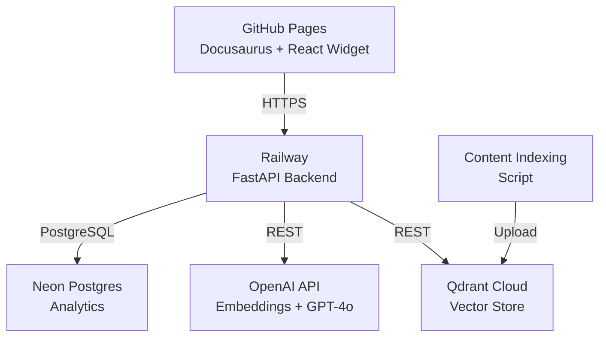

# Research: Integrated RAG Chatbot for Physical AI Textbook

**Feature**: 001-rag-chatbot | **Date**: 2025-01-15 | **Status**: Complete

---

## Overview

This document captures research findings and technical decisions for implementing the RAG chatbot. All decisions align with the clarified specification constraints: free-tier services, semantic paragraph chunks (300-500 tokens), 3-5 chunk retrieval, and 2-second response time SLA.

---

## Decision 1: Vector Embedding Model

**Decision**: OpenAI `text-embedding-3-small` (1536 dimensions)

**Rationale**:
- Cost-effective: $0.02 per 1M tokens (vs $0.10 for `text-embedding-3-large`)
- MTS (Multilingual Training Support) benefits future Urdu translation phase
- 1536 dimensions provide good semantic quality for technical content
- Already using OpenAI for GPT-4o mini - reduces API key management

**Alternatives Considered**:
| Model | Pros | Cons | Verdict |
|-------|------|------|---------|
| `text-embedding-3-small` | Low cost, multilingual, good quality | Lower dimensional than large | **CHOSEN** |
| `text-embedding-3-large` | Higher quality (3072 dims) | 5x more expensive | Overkill for textbook |
| `text-embedding-ada-002` | Proven, stable | Legacy, less capable | Deprecated |
| Sentence Transformers (local) | Free, no API calls | Hosting cost, slower inference | Not aligned with architecture |

---

## Decision 2: Chunking Implementation Strategy

**Decision**: Markdown-aware semantic chunking with paragraph preservation

**Rationale**:
- Markdown structure (headers, code blocks, lists) must be respected
- Paragraph-level chunking aligns with 300-500 token requirement
- Code examples must not be split (they're self-contained teaching units)
- Section headers provide valuable context for retrieval

**Implementation Approach**:
```python
# Pseudo-code for chunking strategy
def chunk_markdown(content: str) -> List[Chunk]:
    1. Parse markdown to AST (using markdown-it or similar)
    2. Traverse AST, tracking:
       - Current section path (e.g., "Module 1 > Sensors > LIDAR")
       - Token count (using tiktoken for cl100k_base)
       - Code block boundaries
    3. Create chunks:
       - Prefer paragraph boundaries
       - Never split code blocks
       - Include section context in chunk metadata
       - Target 400 tokens (midpoint of 300-500 range)
```

**Alternatives Considered**:
| Approach | Pros | Cons | Verdict |
|----------|------|------|---------|
| Markdown-aware semantic | Preserves structure, better retrieval | More complex parsing | **CHOSEN** |
| Fixed character chunks | Simple, fast | Breaks sentences, loses context | Reject - poor UX |
| Sentence-level chunks | Fine granularity | Too many chunks, slower | Reject - performance |
| Section-based chunks | Topic boundaries | Variable size, may exceed tokens | Reject - too large |

---

## Decision 3: Session Storage Approach

**Decision**: Browser-local storage (localStorage + IndexedDB) with Neon Postgres for server-side conversation history (optional backup)

**Rationale**:
- Spec requires anonymous sessions - no auth, no server-side session management
- localStorage sufficient for chat history (typical session < 100KB)
- IndexedDB for cached responses (larger payloads)
- Neon Postgres used for vector metadata and optional analytics, not session state
- Aligns with privacy requirement: no PII stored

**Storage Schema**:

**Browser (localStorage)**:
```typescript
interface ChatSession {
  sessionId: string;        // UUID
  startTime: number;        // timestamp
  messages: ChatMessage[];
  contextWindow: string[];  // recent message IDs for sliding window
}

interface CachedResponse {
  questionHash: string;     // hash of normalized question
  answer: string;
  citations: Citation[];
  timestamp: number;
}
```

**Neon Postgres (server-side - optional)**:
```sql
-- Only for analytics, not session state
CREATE TABLE interaction_log (
    id UUID PRIMARY KEY,
    session_id TEXT,         -- anonymized
    question TEXT,
    has_answer BOOLEAN,
    tokens_used INTEGER,
    created_at TIMESTAMPTZ DEFAULT NOW()
);
```

**Alternatives Considered**:
| Approach | Pros | Cons | Verdict |
|----------|------|------|---------|
| Browser-only | Private, simple, fast | No cross-device sync | **CHOSEN** |
| Hybrid with Neon backup | Cross-device potential | Requires session ID management | Reject - out of scope |
| Server-side sessions | Full control | Requires auth infrastructure | Reject - out of scope |

---

## Decision 4: Caching Strategy

**Decision**: Question-based caching with 24-hour TTL, semantic similarity fallback

**Rationale**:
- Students often ask similar questions (caching reduces cost and latency)
- 24-hour TTL ensures content updates propagate within a day
- Semantic similarity allows cached answers for paraphrased questions

**Cache Design**:
```typescript
interface CacheKey {
  questionHash: string;     // SHA-256 of normalized question text
  contextHash?: string;     // Optional: hash of selected text context
}

interface CacheEntry {
  key: CacheKey;
  answer: string;
  citations: CitationReference[];
  createdAt: number;
  ttl: 86400000;            // 24 hours in ms
  hitCount: number;
}
```

**Cache Lookup Strategy**:
1. Exact match: Hash question, check cache
2. Semantic fallback: If no exact match, embed question and search cached Q&A
3. If cached answer has >0.85 similarity, return it
4. Otherwise, call API and store result

**Alternatives Considered**:
| Strategy | Pros | Cons | Verdict |
|----------|------|------|---------|
| Exact match + semantic fallback | High hit rate, better UX | Complex, uses extra embeddings | **CHOSEN** |
| Exact match only | Simple, predictable | Lower hit rate | Reject - misses opportunities |
| No caching | Simplest | Higher cost, slower | Reject - violates SLA |
| Persistent cloud cache | Cross-user benefits | Privacy concerns (anonymous) | Reject - privacy |

---

## Decision 5: Docusaurus Integration Pattern

**Decision**: Custom client component using `useContext` for state, swizzled theme component for sidebar injection

**Rationale**:
- Docusaurus supports custom components via `clientModules` in `docusaurus.config.js`
- Swizzling allows injecting sidebar into every doc page
- React Context manages chat state across navigation
- Existing config uses `src/css/custom.css` - pattern established

**Integration Points**:

**1. docusaurus.config.js** - Add client module:
```javascript
export default {
  // ... existing config
  themes: [
    [
      require.resolve("@easyops-cn/docusaurus-theme-local"),
      {
        // No config needed
      },
    ],
  ],
  clientModules: [require.resolve('./src/chatbot/bootstrap.js')],
};
```

**2. Create React component** (`src/chatbot/SidebarChatbot.tsx`):
```typescript
interface SidebarChatbotProps {
  currentLesson: string;     // From Docusaurus route metadata
  onTextSelect: (text: string) => void;
}
```

**3. Text selection handling** - Use window selection API:
```typescript
const handleTextSelection = () => {
  const selection = window.getSelection();
  const text = selection?.toString();
  if (text && text.length > 20 && text.length < 5000) {
    // Valid selection - enable "Ask about selection" button
  }
};
```

**Alternatives Considered**:
| Approach | Pros | Cons | Verdict |
|----------|------|------|---------|
| Swizzled theme component | Full control, per-page state | Requires swizzle maintenance | **CHOSEN** |
| Inline component | Simple | Limited to specific pages | Reject - not site-wide |
| iframe/external widget | Isolated | CORS, no text selection access | Reject - UX issue |
| Browser extension | No code changes | Installation friction | Reject - adoption barrier |

---

## Decision 6: FastAPI Project Structure

**Decision**: Standard FastAPI structure with dependency injection for services

**Project Layout**:
```text
backend/
├── app/
│   ├── __init__.py
│   ├── main.py              # FastAPI app entry point
│   ├── api/
│   │   ├── __init__.py
│   │   ├── routes/
│   │   │   ├── chat.py      # /chat, /chat/selection endpoints
│   │   │   └── health.py    # /health endpoint
│   │   └── dependencies.py  # Auth, rate limiting (if needed)
│   ├── core/
│   │   ├── __init__.py
│   │   ├── config.py        # Settings, env vars
│   │   └── security.py      # (Future) If auth is added
│   ├── models/
│   │   ├── __init__.py
│   │   ├── chat.py          # Pydantic models for requests/responses
│   │   └── document.py      # Content chunk models
│   ├── services/
│   │   ├── __init__.py
│   │   ├── embedding.py     # OpenAI embedding service
│   │   ├── retrieval.py     # Qdrant vector search
│   │   ├── generation.py    # GPT-4o mini answer generation
│   │   └── citation.py      # Source citation formatting
│   └── db/
│       ├── __init__.py
│       ├── qdrant.py        # Qdrant client
│       └── neon.py          # Neon Postgres (analytics only)
├── scripts/
│   ├── index_content.py     # Parse docs, generate embeddings, store
│   └── seed_qdrant.py       # Initial Qdrant collection setup
├── tests/
│   ├── test_api.py
│   ├── test_services.py
│   └── test_integration.py
├── pyproject.toml
└── requirements.txt
```

**Alternatives Considered**:
| Structure | Pros | Cons | Verdict |
|-----------|------|------|---------|
| Standard FastAPI layered | Conventional, testable | More files | **CHOSEN** |
| Single-file app | Simple | Becomes unmaintainable | Reject - scale issue |
| Nano-services (multiple repos) | Isolated scaling | Deployment complexity | Reject - overkill |

---

## Decision 7: Error Handling & Retry Strategy

**Decision**: Exponential backoff with circuit breaker for external APIs

**Rationale**:
- OpenAI and Qdrant can have transient failures
- Circuit breaker prevents cascading failures
- User sees cached responses during outages

**Retry Configuration**:
```python
RETRY_CONFIG = {
    "max_attempts": 3,
    "backoff_factor": 0.5,      # 0.5s, 1s, 2s between retries
    "timeout": 10.0,            # 10 second timeout per attempt
    "circuit_breaker_threshold": 5,  # Open after 5 consecutive failures
    "circuit_breaker_timeout": 60,   # Retry after 60 seconds
}
```

**User-Facing Error States**:
| Condition | User Message | Action |
|-----------|--------------|--------|
| No results found | "This topic isn't covered in the textbook. Try asking about [suggested topics]." | None |
| Service unavailable (cached) | "Showing cached answer from previous search." | Display cached result |
| Service unavailable (no cache) | "The chat service is temporarily unavailable. Your question has been queued and will retry automatically." | Queue for retry |
| Rate limited | "Many people are asking questions right now. Please wait a moment." | Exponential backoff |

---

## Decision 8: Deployment Architecture

**Decision**: Backend on Railway (or Render) with free tier, frontend on existing GitHub Pages

**Rationale**:
- GitHub Pages already hosts Docusaurus site
- Railway free tier: 512MB RAM, 0.5 CPU, 500hrs/month sufficient for MVP
- Environment variables for API keys (not committed to git)
- CORS configuration allows GitHub Pages origin

**Architecture Diagram**:


**Environment Variables**:
```bash
# Backend (Railway)
QDRANT_URL=https://e2bc507b-953a-453d-a847-735aa2ee1988.us-east4-0.gcp.cloud.qdrant.io:6333
QDRANT_API_KEY=***
OPENAI_API_KEY=***
NEON_DATABASE_URL=***
CORS_ORIGINS=https://soban-saleem.github.io
```

---

## Open Questions (Deferred to Implementation)

1. **Exact chunking algorithm**: Requires testing on actual textbook content to tune token boundaries
2. **Cache hit rate targets**: Will measure after initial deployment; may adjust similarity threshold
3. **Indexing frequency**: For now, manual re-index when content updates; future: webhook-based

---

## References

- OpenAI Embeddings: https://platform.openai.com/docs/guides/embeddings
- Qdrant Cloud: https://qdrant.tech/documentation/cloud/
- FastAPI Project Structure: https://fastapi.tiangolo.com/project-generation/
- Docusaurus Client Modules: https://docusaurus.io/docs/api/client-modules
